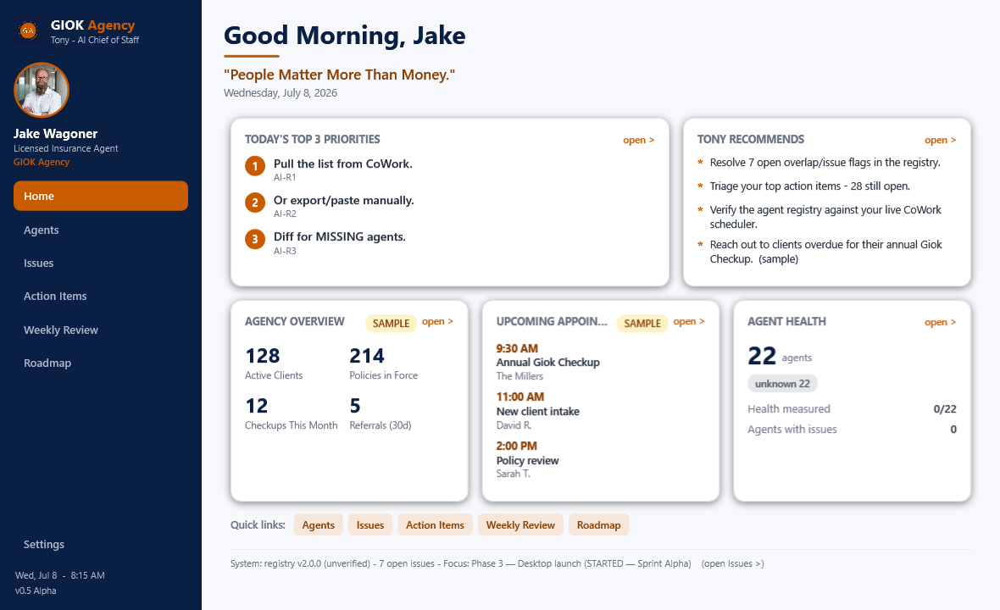
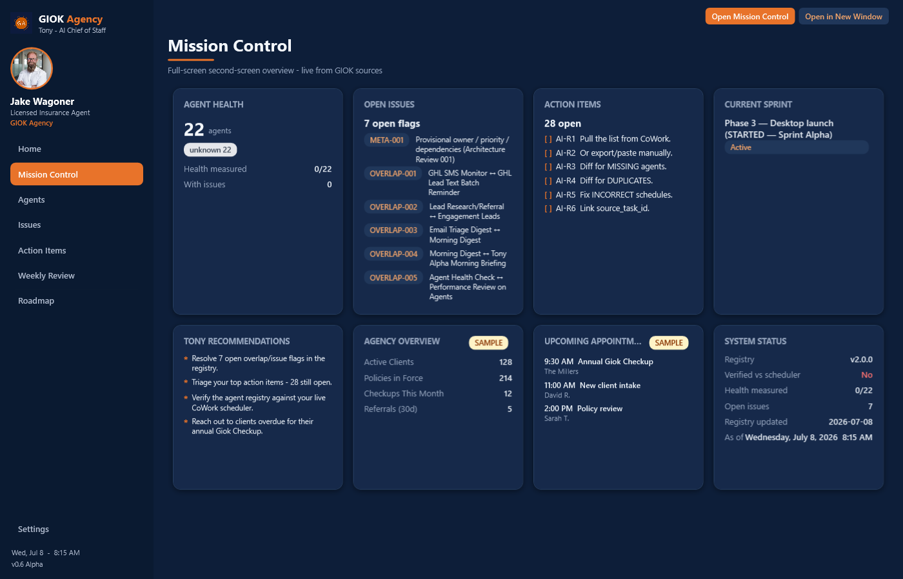
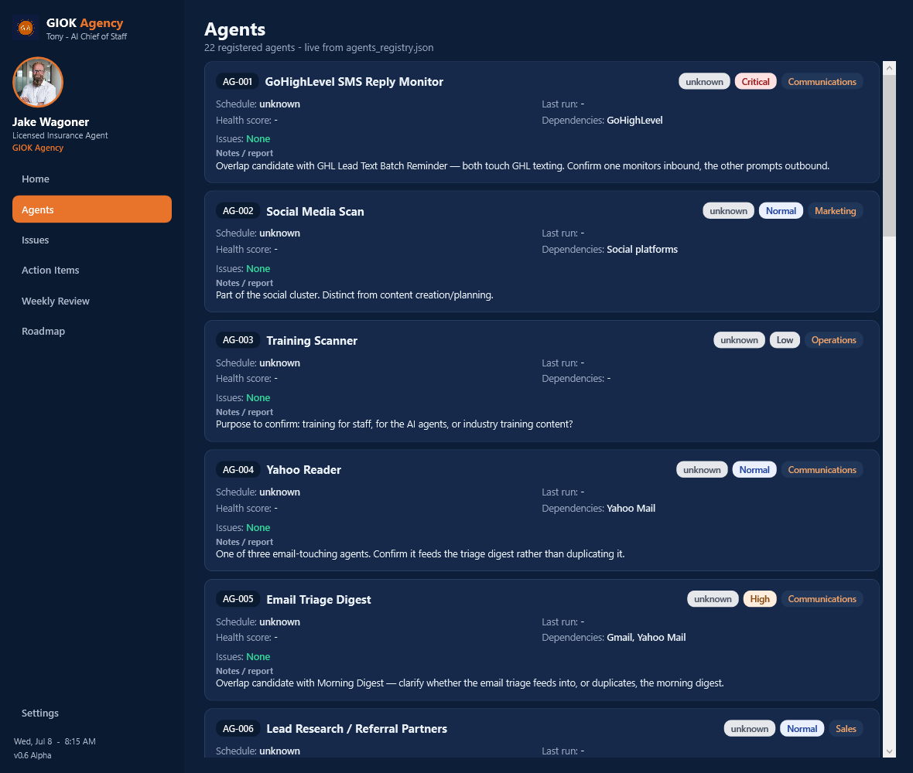
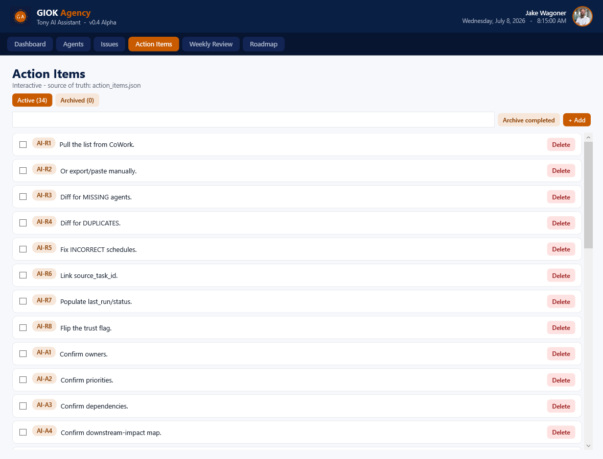

# Tony Alpha — Desktop Dashboard

A local desktop command center that reads the registry and shows everything at a glance.
Branded via a swappable **theme layer** (currently GIOK) — see [THEME.md](THEME.md).
Branding never affects functionality; it's pure presentation on top of the app.



---

## How to launch

**Normal use — the "GIOK" desktop icon**, or double-click **`launch-tony.vbs`**.
This is the **silent launcher**: no PowerShell or command-prompt window ever appears —
only the Tony Alpha application window, so it feels like a native Windows app.

**Debug / see output — `launch-tony.bat`.** Same app, but runs in a visible console so
you can read errors. Handy when something isn't working.

**From a terminal:**
```powershell
powershell.exe -NoProfile -STA -ExecutionPolicy Bypass -File dashboard.ps1
```

A window titled *Tony Alpha – Command Center* opens, centered, with a live clock.

### Launchers at a glance
| File | Console window? | Use |
|------|-----------------|-----|
| `launch-tony.vbs` | none (silent) | everyday launch / desktop icon |
| `launch-tony.bat` | yes (visible) | debugging, seeing errors |

> The desktop "Tony Alpha" icon runs `wscript.exe "launch-tony.vbs"`, which starts
> PowerShell hidden (`-WindowStyle Hidden`, window style 0). If startup ever fails, a
> native error dialog is shown instead of failing silently.

### Requirements
Nothing to install. Uses **Windows PowerShell 5.1** + **.NET WPF**, both built into
Windows 11. (Node.js / Python are **not** required and are not installed on this machine —
which is why WPF was chosen over Electron.)

---

## Multi-window & Mission Control (Sprint Hotel)

**Open in New Window** — a persistent toolbar (top-right of the body) pops the current view
into its own native window: Agents, Issues, Action Items, Weekly Review, Roadmap,
Recommendations, Agency, Appointments. Each popout is a **live read-only snapshot** — GIOK
branded, titled, rendered from the same source files, with **no shared/duplicated state**
(so a popout never hijacks the main window; edits stay in the main app).

**Mission Control** — a dense, full-screen **second-monitor** overview (sidebar tab, or the
**Open Mission Control** button which opens it in its own window). Eight live panels: Agent
Health, Open Issues, Action Items, Current Sprint, Tony Recommendations, Agency Overview
(sample), Upcoming Appointments (sample), and System Status.



## Dark executive theme + "Ask Tony" command bar (Sprint Golf)

GIOK ships in a **premium dark theme** by default — dark navy background, orange highlights,
light text, rounded cards. It's fully theme-driven: edit `theme/theme.json` (`mode` + `colors`)
to switch palettes, including back to light, without touching code. (Themes carry a `heading`
color so titles render correctly on both dark and light backgrounds.)

The Home screen has a global **"Ask Tony" command bar** (focus with **Ctrl+K**). It runs local
commands — no external AI yet, just the foundation:
- `open agents` / `open issues` / `open action items` / `open weekly review` / `open roadmap` → navigate
- `add task: <text>` → creates a new action item in `action_items.json`

Command parsing lives in `core/command-bar.ps1` (`Invoke-TonyCommand`), separate from the UI.

## Executive home (Sprint Echo)

GIOK opens on **Jake's executive command center**, not a system console. A **left sidebar**
(GIOK logo, Jake's photo, name, "Licensed Insurance Agent", "GIOK Agency", nav, Settings,
version, clock) sits beside a main area that answers *"what does Jake need to know right now?"*

**Home** shows: greeting, the brand line *"People Matter More Than Money."*, **Today's Top 3
Priorities** (live from `action_items.json`), **Agency Overview** (placeholder metrics),
**Tony Recommends** (live signals + sample nudges), **Upcoming Appointments** (placeholder),
**Agent Health** (live from the registry), quick links, and a demoted system-status strip.

Placeholder groups (appointments, agency metrics, some recommendations) are clearly marked
and structured so live integrations can replace them later.

**Every Home card is clickable** (hover highlight, "open >" affordance, hand cursor): Top 3 →
Action Items, Tony Recommends → Recommendations, Agency Overview → Agency, Upcoming
Appointments → Appointments, Agent Health → Agents, and the system strip → Issues. Cards
whose real tab doesn't exist yet open a focused **"Coming soon"** detail view (Agency,
Appointments, Recommendations) with sample data and a back-to-Home button.

### Navigation (left sidebar)
| Tab | Reads from | Shows |
|-----|-----------|-------|
| **Home** | registry + action_items.json + issues_log.md + ROADMAP.md | Executive summary of the day |
| **Agents** | `agents_registry.json` | Every registered agent with all fields |
| **Issues** | `issues_log.md` | The full issues log |
| **Action Items** | `action_items.json` | Interactive task manager |
| **Weekly Review** | `weekly_status.md` | The weekly status |
| **Roadmap** | `ROADMAP.md` | The roadmap |
| **Settings** | theme | Workspace & branding info |

**Agents view** shows, per agent: ID (`AG-###`), name, owner/department, priority, status,
last run, health score, schedule, dependencies, issues, and notes/report.



### Action Items — interactive task manager
The Action Items tab is a real, local task manager. **Source of truth: `action_items.json`**
(the app renders from JSON, not raw markdown).
- **Check** an item → marks complete, strikes it through, and saves.
- **+ Add** (or press Enter in the box) → creates a new item (`AI-###` auto-numbered).
- **Delete** → removes an item.
- **Archive completed** → moves all done items to the archive.
- **Active / Archived** toggle → review archived items; **Restore** brings one back.

State is persisted to `action_items.json`; `action_items.md` remains as a human-readable
narrative/log and can be regenerated from JSON later. No external integrations — fully local.



### What's live vs placeholder
- **Live from files:** Agent Summary, Registry Health, and the Agents view (registry);
  Issues / Action Items / Weekly Review / Roadmap (their `.md` files, read on each navigation).
- **Placeholder:** only *Current Sprint* (no backing file yet).

Every navigation re-reads the source files, so the hub always reflects the latest content —
`agents_registry.json` stays the single source of truth and nothing is duplicated.

---

## Architecture (business logic is separate from the UI)

```
dashboard/
├── core/
│   └── tony-core.ps1     # BUSINESS LOGIC ONLY — reads agents_registry.json,
│                         # computes the model (summary, health, etc.). No UI code.
├── ui/
│   └── tony-ui.ps1       # PRESENTATION ONLY — turns a model into a WPF visual.
│                         # Never reads the registry, never computes anything.
├── dashboard.ps1         # ENTRY POINT — wires core → ui, opens the window
│                         # (or renders a PNG with -Screenshot). No logic, no layout.
├── launch-tony.bat       # double-click launcher
└── docs/
    └── dashboard-preview.png
```

**Data flow:** `agents_registry.json` → `Get-TonyModel` (core) → `New-TonyDashboardVisual` (ui) → window.

**Single source of truth:** the registry JSON is read live at launch. No data is duplicated;
the dashboard is purely a *renderer* of it — consistent with the roadmap principle that a
future web/Android UI is just another renderer of the same JSON.

**Why the layers are split:** the model object (`Get-TonyModel`) is the contract. Swap the WPF
UI for a web front end later and the core is reused unchanged; change the registry schema and
only the core adapts. Neither layer reaches into the other.

### Render a screenshot (headless)
```powershell
powershell.exe -NoProfile -STA -ExecutionPolicy Bypass -File dashboard.ps1 -Screenshot out.png
# optional: -Now "2026-07-08 08:15" to force the greeting/clock, -Width / -Height to size
```
This uses the *same* UI builder as the live window, rendered to PNG via WPF `RenderTargetBitmap`.

---

## Not in this build (by design)
- ❌ Gmail / Calendar / any API connection
- ❌ Live wiring of Open Issues / Action Items / Sprint (still placeholder)
- ❌ Writing back to the registry (read-only)

Goal of Sprint Alpha was strictly: **prove Tony launches as a real desktop app.** Done.
